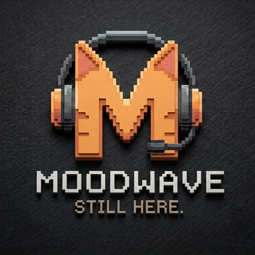
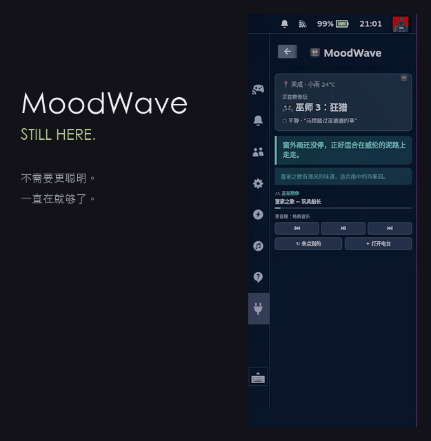
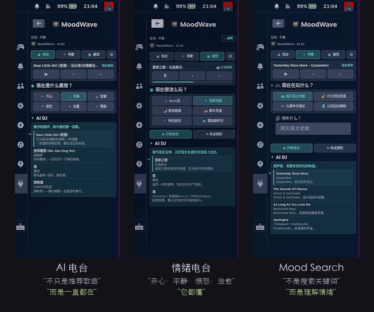
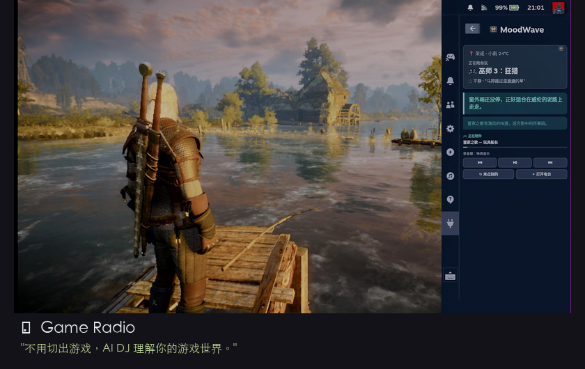
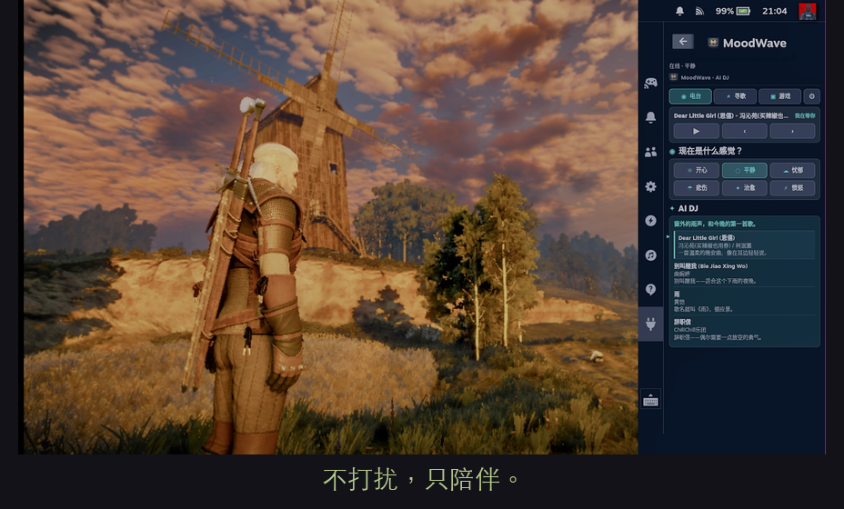
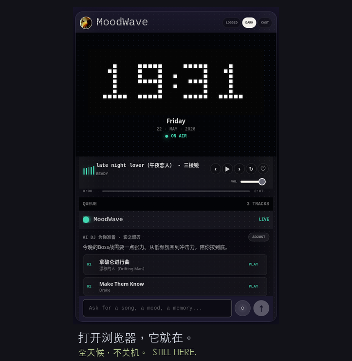

<p align="center"></p>

# 🎵 MoodWave V6 — AI DJ 电台

<p align="center"></p>

## 它是什么

说出你现在的状态——

剩下的全部由 AI DJ 自动完成：**开场白、歌单、推荐理由、语音朗读、自动播放。**

| ✅ 这样说 | ❌ 不这样说 |
|---------|---------|
| 今晚适合安静一点 | 根据您的当前情绪推荐以下歌曲 |
| 忘了歌名，也能找到歌 | 智能歌单算法 |
| 它好像知道你现在想听什么 | AI 情绪分析 |
| 今晚适合慢一点 | 根据用户偏好推荐 |
| 适合边刷素材边放空 | AI 已分析当前用户状态 |
| 外面下雨的时候，总该听点慢的 | 根据算法生成歌单 |

---

## 为什么你需要它

| 😩 Steam Deck 玩家的痛点 | ✨ MoodWave 怎么解决 |
|:--|:--|
| 切歌要退出游戏，打断沉浸感 | **Decky 插件游戏内操控**，按 `...` 就能切歌换氛围 |
| 不知道听什么，翻歌单 10 分钟 | **AI 一句话生成歌单**，心情、天气、日期自动感知 |
| 一个人打游戏有点孤单 | **DJ 语音陪伴**，像电台一样有温度的解说 |
| AI 不懂你口味，推荐总是跑偏 | **Music DNA**，网易云扫码导入，AI 分析你长期音乐人格 |

---
## 🎧 Music DNA：让 AI DJ 越来越懂你

MoodWave 可以从网易云喜欢的音乐和收藏歌单中分析你的音乐人格。

它不会只是同步歌单。

而是：

- 分析你的**长期音乐口味**
- 理解你的**情绪偏好**
- 理解你的**游戏陪伴倾向**
- 理解你**适合什么氛围**

之后，**AI Radio、AI 寻歌、Game Radio** 都会参考你的 Music DNA。

MoodWave 会越来越像——**真正懂你的 AI DJ**。

```
✦ 你的 Music DNA
怀旧 / 平静 / 探索
JRPG OST / LoFi / City Pop
```

---

## 核心体验

<p align="center"></p>

### 📻 AI 电台 — 按心情开电台

选一个心情（开心 / 平静 / 忧郁 / 悲伤 / 治愈 / 愤怒），AI DJ 自动生成：

- 🎙️ **DJ 开场白** — 克制少语，15-30 字，约 40% 场景只放歌不说话
- 🎵 **精编歌单** — 每首歌附带 AI 写的推荐理由
- 🔊 **语音朗读** — DJ 帮你把开场白念出来，温柔克制
- ▶️ **自动播放** — 点一下，剩下的全自动

### 🎮 Game Radio — 游戏氛围电台

<p align="center"></p>

**不用切出游戏**，Decky 插件里一键开启。

游戏模式下，插件渲染**极简世界卡片**——天气 ☁️ + 游戏名 🎮 + 心情 😌 + 一句温柔的独白，不抢注意力。

> 你在玩什么，它知道。**中世纪篝火 → 民谣感、赛博霓虹 → Synthwave。**

### 🔍 AI 寻歌 — 自然语言找歌

告诉 AI 你想听什么，它帮你找。不是搜索引擎——AI 理解**情绪、画面感、年代感、游戏感**，同时参考你的 Music DNA。

```
"想听适合下雨天放空的英文老歌"
"有没有像巫师3原声那种中古民谣"
"来点 90 年代港乐"
"像小时候网吧一样"
```
<p align="center"></p>


---

## 平台支持

| 平台 | 模式 | 说明 |
|------|------|------|
| 🎮 Steam Deck | 桌面 PWA + 游戏模式 Decky 插件 | 主力平台，游戏模式极简世界卡片 |
| 🎮 Switch | 浏览器伴侣 | Homebrew 打开网页即可，辅助场景 |
| 🖥️ 树莓派 | 局域网电台 | 部署在 Pi 上，全家人共用 |
| 📱 iPhone | PWA 添加到桌面 | 手机控制 + 电台随身听 |

---

## 技术亮点

| 亮点 | 说明 |
|------|------|
| 🧠 **AI DJ 灵魂系统** | 克制少语人格 + 世界连续性 + 情绪势能追踪——像一个活在你时空里的 DJ |
| 🌍 **游戏世界感** | 12 款游戏世界 DNA 映射（巫师3→中世纪篝火、赛博朋克→霓虹都市孤独） |
| 🖼️ **极简世界卡片** | 游戏模式 Decky 插件渲染天气+游戏名+心情+vibe，不抢游戏注意力 |
| 🧬 **Music DNA 升级** | 三维音乐人格：核心情绪 / 聆听状态 / 音乐性格，比标签更深入 |
| 🌤️ **情绪势能追踪** | 记录近期情绪倾向 + 情绪动量，避免连续推荐同质化 |
| 🎭 **世界连续性** | DJ 活在真实时空里——知道外面下雨、今天是节气、上次你听的最后几首 |
| 🔊 **Fish Audio TTS** | DJ 语音朗读，温柔克制的声线，不是冷冰冰的播音腔 |
| 🔗 **网易云深度集成** | 扫码登录，读取红心、歌单、日推、私人 FM |
| 📡 **DLNA/UPnP 投播** | Streaming 到客厅音箱 / 树莓派 DAC |
| 🛡️ **熔断器保护** | 所有外部 API 有自动降级，单点故障不影响使用 |

---

## 快速开始

<p align="center"></p>

### Steam Deck 一键安装

```bash
git clone https://github.com/zhaozhongyang2023/markradio.git ~/moodwave
cd ~/moodwave
bash scripts/install-steamdeck.sh --repo https://github.com/zhaozhongyang2023/markradio.git
```

安装后，扫码登录网易云 → AI 自动生成你的 Music DNA → 电台变得越来越懂你。

详细教程 → [INSTALL.md](./INSTALL.md)（零基础可操作，全程复制粘贴）

### 配置

支持 `.env`（树莓派/开发）或 `~/.config/moodwave/config.env`（Steam Deck）。

| 变量 | 必填 | 说明 |
|------|------|------|
| `AI_PROVIDER` | ✅ | deepseek / openai / qwen / gemini / custom |
| `AI_API_KEY` | ✅ | AI 平台 API Key（DeepSeek 免费注册） |
| `AI_BASE_URL` | - | 自定义 API 地址 |
| `AI_MODEL` | - | 模型名（自动匹配平台） |
| `FISH_AUDIO_API_KEY` | - | Fish Audio 语音朗读 |
| `NETEASE_API_BASE` | - | 网易云 API 地址（Music DNA 需要） |
| `OPENWEATHER_API_KEY` | - | 天气 API（不填默认晴天） |
| `MUSIC_DIR` | - | 本地音乐目录 |

### 树莓派部署

```bash
git clone https://github.com/zhaozhongyang2023/markradio.git ~/moodwave
cd ~/moodwave
npm install
cp .env.example .env   # 编辑填入 AI Key 等配置
npm run build
npm start
```

管理命令：

```bash
bash scripts/moodwave.sh start    # 启动全部服务（含 Firefox 全屏）
bash scripts/moodwave.sh stop     # 停止全部服务
bash scripts/moodwave.sh refresh  # 刷新（清理缓存 + 重启）
bash scripts/moodwave.sh status   # 查看服务状态
bash scripts/moodwave.sh server   # 仅启动后端（无浏览器）
```

### 本地开发

```bash
npm install && cp .env.example .env
npm run dev:api    # 终端 1
npm run dev:web    # 终端 2 → http://localhost:8080
```

---

<details>
<summary>📡 API（开发者点击展开）</summary>

## API

兼容 V3/V4/V5 旧接口：

```
GET  /api/health           # 健康检查
GET  /api/status           # 完整状态
POST /api/ai/radio         # AI 电台（参考 Music DNA + 情绪势能）
POST /api/ai/search        # AI 寻歌（参考 Music DNA）
POST /api/ai/next-radio    # 换个氛围
POST /api/ai/game-radio    # 游戏电台（注入 DJ 灵魂 + 游戏世界感 + vibe 文案）
POST /api/play             # 播放
POST /api/pause            # 暂停
POST /api/next             # 下一首
POST /api/prev             # 上一首
POST /api/switch-mode      # 切换电台/寻歌/游戏模块
GET  /ws/stream            # WebSocket 实时推送

# 🧬 Music DNA API
GET    /api/profile/music-dna          # 查看 Music DNA
POST   /api/profile/music-dna/generate # AI 分析生成 Music DNA
POST   /api/profile/music-dna/save     # 手动保存 Music DNA
POST   /api/profile/music-dna/reset    # 重置 Music DNA
```


</details>

---

## 安全

- 所有 API Key 只存本机，权限 `600`
- 前端和 Decky 插件不含第三方密钥
- 安装脚本不打印用户输入的 Key
- `.env`、`data/`、`dist/` 不进入版本控制

---

<details>
<summary>📦 发布（开发者点击展开）</summary>

## 发布

```bash
node scripts/package-steamdeck.mjs   # → release/
npm test                              # 29 tests
```


</details>

---

## ❤️ 支持项目

如果 MoodWave 让你的 Steam Deck 多了一点陪伴——

<p align="center"></p>

- ⭐ **Star 这个仓库**——让更多人看到
- ☕ **微信扫码**请 DJ 喝杯咖啡
- 🛒 **闲鱼搜 MoodWave**——获取一键安装 + 终身技术支持
